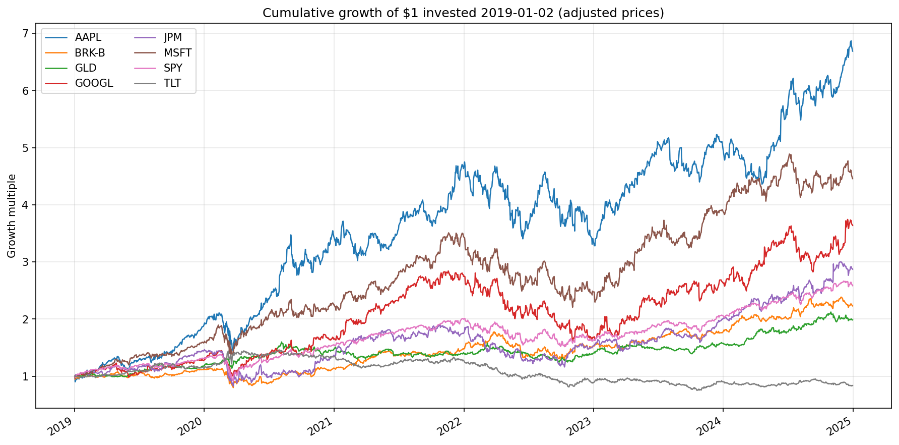
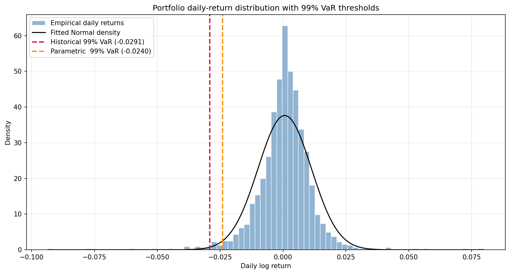
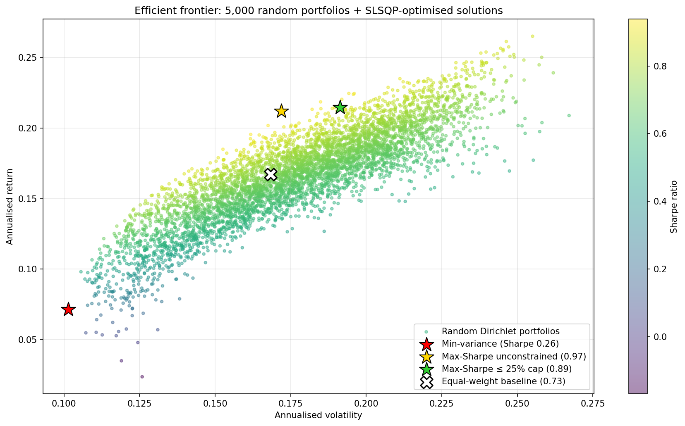
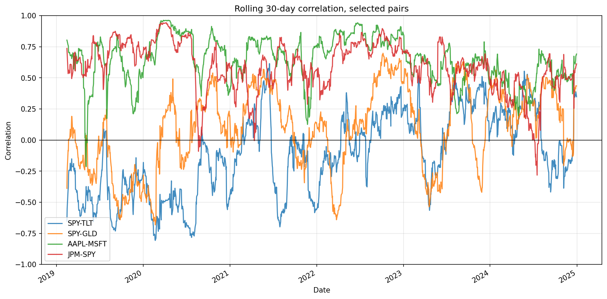
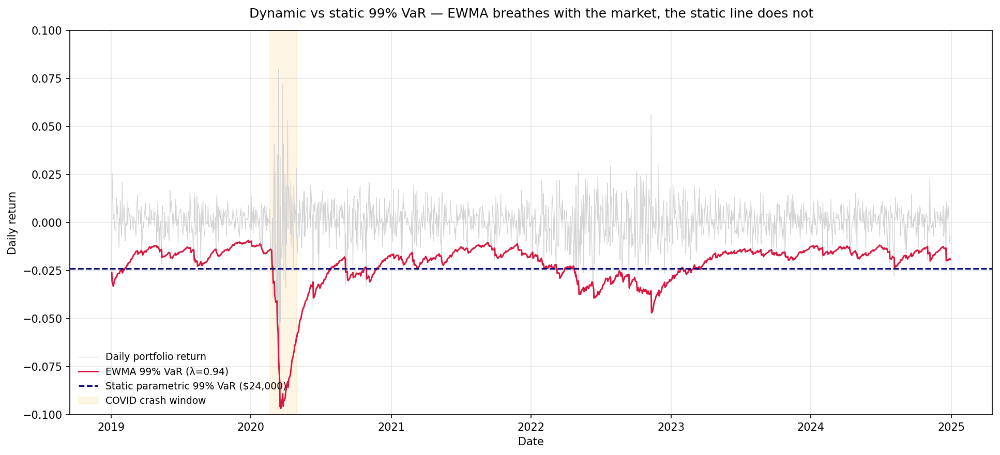

# Financial Portfolio Risk Analysis


Quantitative risk analysis system for an 8-asset multi-asset portfolio (US equities, long-duration treasuries, gold). Implements three Value-at-Risk methodologies — historical simulation, parametric (normal), and Monte Carlo with Cholesky decomposition — alongside SLSQP efficient-frontier optimization and Kupiec backtesting validation.

Built on 1,508 trading days of daily returns (2019–2024) spanning the COVID crash, the 2022 rate-hike bear market, and the 2023–24 bull recovery.

> **Read first:** [`reports/Risk Report.pdf`](reports/Risk%20Report.pdf) — the polished 2-page risk report for a non-technical stakeholder, with all charts embedded and a concrete portfolio recommendation. ([`Risk Report.md`](reports/Risk%20Report.md) is the source markdown.)
>
> **Run first:** [`notebooks/00_executive_summary.ipynb`](notebooks/00_executive_summary.ipynb) — loads cached data and reproduces every chart and headline number below in ~30 seconds.

## Quickstart

```bash
pip install -r requirements.txt && jupyter lab notebooks/00_executive_summary.ipynb
```

## Results at a glance

- **Equal-weight baseline:** 16.71% annualised return, 16.83% annualised volatility, Sharpe 0.725 against a 4.5% risk-free rate.
- **Fat tails are real, and quantified:** historical 99% VaR ($29,146) exceeds parametric 99% VaR ($24,000) by $5,146. Jarque–Bera p-value ≈ 0 with excess kurtosis +11.6 formally rejects Normality (notebook 03).
- **Model is statistically valid:** Kupiec proportion-of-failures backtest on a 252-day held-out window — 2 actual breaches against 2.5 expected, p-value 0.73 (notebook 06).
- **Diversifiers earn their place — with a caveat.** Adding GLD + TLT to a 6-equity equal-weight portfolio cuts 99% VaR by 25% ($38,939 → $29,146) at a 4.16 ppt return cost. The benefit is real but regime-dependent: 2022 broke the bond-equity inverse correlation, and the regime stress test in notebook 03 shows the diversification effect varies sharply across windows.
- **Dynamic vs static volatility matters in practice.** RiskMetrics-style EWMA VaR (λ = 0.94, notebook 07) moves between ~$9,300 (calm Dec 2019) and ~$96,700 (peak COVID March 2020) — a 10× range that a static $24,000 number averages over. On the 2024 hold-out, EWMA is well-calibrated at 95% (16 breaches vs 12.6 expected, Kupiec p = 0.34) where the static parametric model is **rejected** as over-conservative (5 breaches, p = 0.013).
- **Concrete recommendation:** SLSQP max-Sharpe with a 25% per-asset cap improves Sharpe from 0.725 → 0.886 without concentrating into a single name. The unconstrained optimum (Sharpe 0.970) loads 90% into AAPL + GLD and is rejected as brittle.



## Key Findings

Equal-weight baseline portfolio, $1,000,000 notional:

| Metric | Value |
| --- | ---: |
| Annualised return | 16.71% |
| Annualised volatility | 16.83% |
| Sharpe ratio (risk-free = 4.5%) | 0.725 |
| 99% Historical VaR (1-day) | $29,146 |
| 99% Parametric VaR (1-day) | $24,000 |
| 99% Monte Carlo VaR (1-day, 10k paths, seed 42) | $24,017 |
| 99% Historical CVaR / Expected Shortfall | $43,829 |
| 99% Monte Carlo CVaR | $27,734 |
| Historical − parametric VaR gap | $5,146 |

**Fat-tail evidence.** The $5,146 gap between historical and parametric 99% VaR is direct evidence that daily returns have fatter tails than the Normal distribution predicts. The diagnostic in notebook 03 confirms this formally: sample skewness −0.54, excess kurtosis +11.6, Jarque–Bera p-value ≈ 0. The Normal-distribution assumption systematically under-states tail risk.



**Cornish-Fisher diagnostic.** A fourth method — Cornish-Fisher modified VaR — corrects the parametric z-score for the empirical skewness and excess kurtosis (notebook 03). It produces a 99% VaR of $55,856, well *above* the historical figure. The overshoot is informative rather than a recommended estimate: with excess kurtosis at +11.6, the cubic moment-adjustment is being applied at the outer edge of its valid range. The takeaway is that the return distribution is so far from Normal that a moments-based fat-tail correction cannot recover the truth — confirming that the only trustworthy tail estimates come from the empirical historical method or a correlation-preserving Monte Carlo simulation.

**Backtesting result.** On a held-out 2024 test window (252 trading days), the parametric 99% VaR model was well-calibrated: 2 actual breaches against 2.5 expected, Kupiec likelihood-ratio p-value = 0.73 (not rejected). The historical model over-estimated risk in 2024 — a regime-effect artifact of the training window (2019–2023) including the COVID and 2022 rate-shock periods, rather than a model-correctness failure.

**Optimization result.** SLSQP mean-variance optimization identifies a maximum-Sharpe allocation reaching 0.970 (vs 0.725 equal-weight), though the unconstrained optimum concentrates 90% of weight in AAPL and GLD. Adding a 25% per-asset cap as a practical constraint produces a diversified allocation across six assets with Sharpe 0.886 — a small in-sample Sharpe cost (8 basis points) for a far more robust real-world portfolio. A 70/30 blended tilt of equal-weight toward the unconstrained optimum raises Sharpe to 0.823 while preserving diversification across all eight assets and holding 99% VaR essentially flat — the recommendation made in `reports/Risk Report.md`.

**Diversification benefit, quantified.** Notebook 03 isolates the contribution of GLD and TLT directly: re-built as an equal-weighted 6-equity portfolio (AAPL, BRK-B, GOOGL, JPM, MSFT, SPY), the 99% VaR rises to $38,939 — a 25% increase versus the actual $29,146 — while annualised return rises from 16.71% to 20.87%. The diversifiers therefore cut 99% VaR by roughly $9,800 at a cost of 4.16 percentage points of return. The correlations explain why: TLT correlates −0.20 with the equity-only book over 2019–2024, and GLD correlates +0.08 (essentially zero). The benefit is real, but the regime stress test (notebook 03) shows it varies sharply by window — 2022's bond-equity joint sell-off is exactly the regime where the diversification effect collapses.



**Regime structure of correlations.** A static covariance matrix — the foundation of parametric VaR — assumes asset correlations are constant. They are not. The SPY-TLT pair (the classic "bonds hedge stocks" relationship) is reliably negative through 2019–2021, then flips positive in 2022 as aggressive rate hikes hurt both equities and long-duration treasuries simultaneously. This is the structural explanation for why parametric VaR misses tail risk during regime shifts.



**Dynamic-volatility VaR (EWMA).** The same problem applies to volatility itself, not just correlation — a static σ averages over regimes that genuinely behaved very differently. RiskMetrics-style EWMA volatility (notebook 07) addresses this by computing a separate σₜ for every day via the recursion σ²ₜ = λ·σ²ₜ₋₁ + (1−λ)·r²ₜ₋₁ with λ = 0.94. The result is a daily VaR forecast that *breathes with the market*: 99% VaR moved between $9,272 (calm Dec 2019) and $96,715 (peak COVID March 2020), a 10× range that no static estimate can capture.



On the 2024 hold-out, the dynamic estimate is materially better calibrated than the static one. At 95% confidence, EWMA produces 16 breaches against 12.6 expected (Kupiec p = 0.34, not rejected) while the static parametric model is **rejected** as over-conservative (5 breaches, p = 0.013). At 99% confidence the comparison is muddier — both models pass Kupiec, EWMA with 6 breaches against 2.5 expected (p = 0.06) and static with 2 breaches (p = 0.73) — because 252 days yields too few tail observations to sharply distinguish models at the 1% level. The honest reading: EWMA is the better point-in-time model, the 95% test is the one with statistical power, and the static figures should be understood as long-run averages rather than current risk estimates. The natural next iteration is GARCH(1,1), which generalises EWMA by allowing the decay structure to float and adding mean-reversion to a long-run vol level.

## Methodology

| Method | Description |
| --- | --- |
| **Historical VaR** | Empirical percentiles of the realised return distribution. No distributional assumptions. |
| **Parametric VaR** | Closed-form Normal: μ + Φ⁻¹(α)·σ via `scipy.stats.norm.ppf` (robust to any confidence level). |
| **Cornish-Fisher VaR** | Parametric VaR with the Normal z-score corrected for sample skewness and excess kurtosis. Used as a fat-tail *diagnostic* — when the correction overshoots historical materially, it signals the distribution is so far from Normal that moment-based adjustments break down. |
| **Monte Carlo VaR** | 10,000 paths sampled from a multivariate Normal with cross-asset correlations preserved via Cholesky decomposition. Convergence verified at 1k / 5k / 10k / 25k / 50k paths. |
| **Efficient Frontier** | 5,000 Dirichlet-random portfolios for visualization; `scipy.optimize` SLSQP with sum-to-one and non-negativity constraints for clean min-variance and max-Sharpe solutions; box-constrained variant (≤ 25% per asset) for the practical recommendation. |
| **CVaR / Expected Shortfall** | Mean of returns exceeding the VaR threshold — the regulatory-preferred measure under Basel III. Closed-form under Normality: μ − σ·φ(z)/α. |
| **Normality diagnostic** | Q-Q plot against the Normal distribution + Jarque–Bera test on skewness and excess kurtosis. |
| **Kupiec POF test** | Likelihood-ratio test of observed vs expected breach frequency on a held-out 252-day window. |
| **EWMA dynamic-volatility VaR** | RiskMetrics recursion σ²ₜ = λσ²ₜ₋₁ + (1−λ)r²ₜ₋₁ with λ = 0.94. Produces a daily VaR forecast that adapts to recent volatility, addressing the static-σ limitation that the regime stress test exposes. |

## Portfolio Composition

| Ticker | Asset | Role |
| --- | --- | --- |
| AAPL | Apple | Large-cap tech growth |
| MSFT | Microsoft | Large-cap tech growth |
| GOOGL | Alphabet | Tech / advertising |
| JPM | JPMorgan Chase | Financials |
| BRK-B | Berkshire Hathaway | Value conglomerate |
| GLD | SPDR Gold Trust | Commodity (gold) |
| TLT | iShares 20+ Year Treasury | Long-duration fixed income |
| SPY | SPDR S&P 500 | Equity market benchmark |

## Repository Structure

```
financial-portfolio-risk-analysis/
├── README.md                            # This file
├── LICENSE                              # MIT
├── requirements.txt                     # Pinned Python dependencies
├── requirements-dev.txt                 # Dev-only deps (pytest)
├── pytest.ini                           # Test configuration
├── .gitignore
├── src/                                 # Analytical core — importable package
│   ├── __init__.py
│   ├── data.py                          # Data loading + constants
│   ├── var.py                           # Historical, parametric, CF, MC, EWMA VaR
│   ├── optimization.py                  # Random frontier + SLSQP max-Sharpe / min-var
│   └── backtest.py                      # Kupiec POF test
├── tests/                               # pytest suite — 30 tests covering src/
│   ├── conftest.py
│   ├── test_var.py
│   ├── test_optimization.py
│   ├── test_backtest.py
│   └── test_ewma.py
├── notebooks/
│   ├── 00_executive_summary.ipynb       # Hero notebook — open this first
│   ├── 01_data_ingestion.ipynb          # Download 2019-2024 prices via yfinance
│   ├── 02_portfolio_metrics.ipynb       # Log returns, covariance, rolling correlations
│   ├── 03_var_analysis.ipynb            # Historical and parametric VaR + Q-Q + Jarque-Bera + regime slice
│   ├── 04_monte_carlo.ipynb             # 10,000-path MC via Cholesky + convergence check
│   ├── 05_efficient_frontier.ipynb      # 5,000 random portfolios + SLSQP min-var, max-Sharpe, 25%-cap
│   ├── 06_backtesting.ipynb             # Kupiec POF test on held-out 2024
│   └── 07_dynamic_volatility_var.ipynb  # EWMA (RiskMetrics, λ = 0.94) dynamic VaR + Kupiec backtest
├── data/                                # Cached for offline reproduction; safe to delete to refresh
│   ├── prices.csv                       # Adjusted close prices
│   ├── log_returns.csv                  # Daily log returns per asset
│   └── portfolio_returns.csv            # Equal-weight portfolio return series
└── reports/
    ├── Risk Report.pdf                  # Generated PDF (open this first)
    ├── Risk Report.md                   # Source markdown with embedded chart references
    └── figures/                         # Hero charts referenced above
```

The CSVs in `data/` are committed so the analysis is fully reproducible offline. To refresh from yfinance, delete `data/prices.csv` and re-run `01_data_ingestion.ipynb` — the other CSVs are regenerated downstream.

To regenerate the PDF after editing `Risk Report.md`, run `python build_risk_report_pdf.py` from the repo root (requires `weasyprint` and `markdown`, installed via `requirements.txt`).

## Running the Analysis

Tested on Python 3.11+.

```bash
# Clone and set up
git clone https://github.com/PloypairaohPat/financial-portfolio-risk-analysis.git
cd financial-portfolio-risk-analysis

# Virtual environment (recommended)
python -m venv venv
source venv/bin/activate          # macOS / Linux
venv\Scripts\activate             # Windows

# Install pinned dependencies
pip install -r requirements.txt

# Run the executive-summary hero notebook
jupyter lab notebooks/00_executive_summary.ipynb
```

The numbered notebooks 01–06 step through the analysis in detail. They expect cached CSVs in `data/`, which are already committed; deleting `data/prices.csv` triggers a fresh yfinance download on the next run of `01_data_ingestion.ipynb`.

## Testing

The analytical core lives in `src/` as a reusable Python package — the notebooks remain the narrative layer, while every VaR method, optimiser, and statistical test is independently importable and unit-tested. The test suite (30 tests) exercises sign conventions, the Cholesky identity `L @ Lᵀ = Σ`, parametric VaR against hand-computed values, Monte Carlo reproducibility, the published reference figures (`$24,017` MC VaR at `seed=42`), EWMA causality, and the Kupiec test under degenerate breach counts.

```bash
pip install -r requirements-dev.txt
pytest -v
```

Expected output: `30 passed`.

## Skills demonstrated

Time-series analysis · probability & statistics · Monte Carlo simulation · constrained optimization (SLSQP) · statistical hypothesis testing (Jarque–Bera, Kupiec POF) · financial risk modeling · modular Python packaging · pytest-driven validation · reproducible scientific computing.

## Tech Stack

- **Python** 3.11+
- **NumPy**, **pandas** — data manipulation
- **SciPy** — statistical testing, constrained optimization
- **Matplotlib** — visualization
- **yfinance** — market data ingestion
- **Jupyter** — notebook environment

## Limitations & Caveats

- All methods calibrated on 2019–2024 — regime-dependent and not guaranteed to generalise.
- Parametric and Monte Carlo VaR both rest on the Normal assumption; the historical–parametric gap and Jarque–Bera test quantify the error.
- Covariance matrix is treated as static in the parametric and Monte Carlo methods, despite rolling-correlation evidence of regime changes (see `02_portfolio_metrics.ipynb` and the chart above). The 2022 SPY-TLT correlation flip is exactly the kind of structural break a static matrix misses. Notebook 07's EWMA model addresses this *for volatility* (though not for cross-asset correlations) and is the recommended point-in-time risk estimate; the static figures remain useful as long-run averages.
- 1-day VaR horizon only; scaling to longer horizons via √t assumes IID returns — which the fat-tail finding above contradicts.
- No transaction costs, liquidity constraints, or position-size caps imposed in the optimization beyond the 25% per-asset box constraint.

## License

MIT — see [LICENSE](LICENSE).