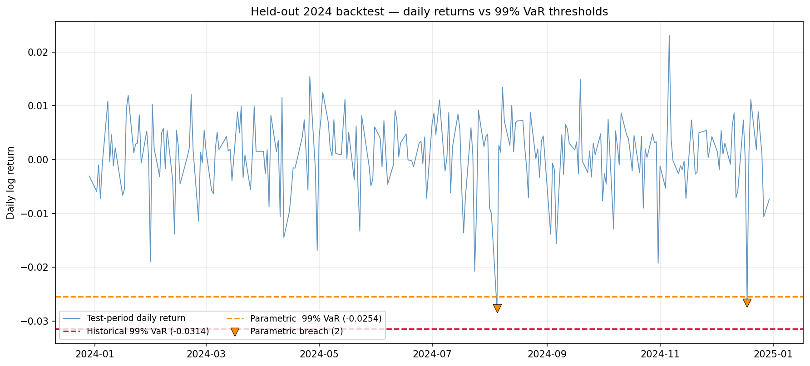
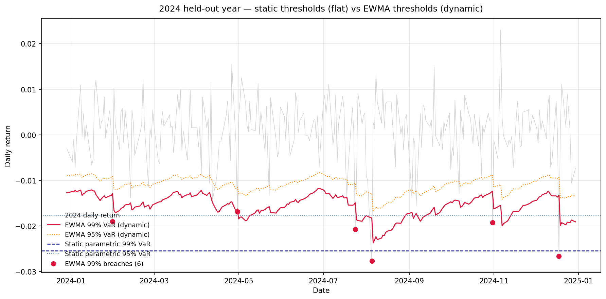

# Portfolio Risk Analysis

**Portfolio:** Equal-weighted 8-asset basket — AAPL, MSFT, GOOGL, JPM, BRK-B, GLD, TLT, SPY
**Period analysed:** Jan 2019 – Dec 2024 (1,508 trading days)
**Portfolio value (assumed):** $1,000,000
**Author:** Pat Ploypairaoh | **Date:** 4/20/2026

---

## Executive Summary

Over the 2019–2024 period this equal-weighted portfolio of four US equities, a value conglomerate, gold, long-duration treasuries, and the S&P 500 delivered 16.71% annualized return at 16.83% annualized volatility, yielding a Sharpe ratio of 0.725 against a 4.5% risk-free rate.

**The headline risk figure: 1-day 99% Value-at-Risk is $29,146 under the historical method and $24,000 under the parametric (normal) method on a $1M portfolio.** The $5,147 gap is direct evidence of fat-tail behaviour in the return distribution — real tail losses arrive more often and run deeper than a normal distribution predicts. On the 1% worst days, expected shortfall (CVaR) averages $43,829 under the historical method — roughly 50% larger than the VaR threshold alone.

Backtesting on a held-out 2024 test year shows the parametric 99% VaR was well-calibrated (2 actual breaches vs 2.5 expected, Kupiec p = 0.73, not rejected). The three other model-confidence combinations were rejected in the over-conservative direction — fewer breaches than expected — reflecting that the 2019–2023 training window contained substantial high-volatility episodes (COVID, the 2022 rate shock) that made models over-estimate risk when applied to the calmer 2024 test period. A dynamic-volatility extension using RiskMetrics-style EWMA (λ = 0.94, Section 4.1) addresses this directly: at 95% confidence EWMA is well-calibrated on the same hold-out (Kupiec p = 0.34, not rejected) where static parametric is rejected. The EWMA 99% VaR forecast as of end-2024 is roughly **$19,000 — materially lower than the static $24,000** — reflecting that end-2024 is a calmer regime than the long-run average.

**Recommendation: Implement the "moderate tilt" allocation (Section 6.2) — a 70% equal-weight / 30% max-Sharpe blend that raises the Sharpe ratio from 0.725 to 0.823, lifts expected return from 16.71% to 18.05%, reduces volatility from 16.83% to 16.45%, and lowers 99% VaR by 0.4%. This allocation strictly dominates the baseline on all four measured metrics while preserving meaningful exposure to every asset. Two alternative allocations — unconstrained max-Sharpe and minimum-variance — are presented in Sections 6.1 and 6.3 and are appropriate under different investment mandates.**

---

## 1. Portfolio Composition

| Ticker | Asset | Role | Weight |
| --- | --- | --- | --- |
| AAPL | Apple | Large-cap tech growth | 12.5% |
| MSFT | Microsoft | Large-cap tech growth | 12.5% |
| GOOGL | Alphabet | Tech / advertising | 12.5% |
| JPM | JPMorgan Chase | Financials | 12.5% |
| BRK-B | Berkshire Hathaway | Value conglomerate | 12.5% |
| GLD | SPDR Gold Trust | Commodity (gold) | 12.5% |
| TLT | iShares 20+ Year Treasury | Long-duration bonds | 12.5% |
| SPY | SPDR S&P 500 | Equity market benchmark | 12.5% |

The portfolio was deliberately constructed to include three asset classes — equities, bonds, gold — to observe diversification effects.

---

## 2. Return & Volatility Profile

| Metric | Value |
| --- | --- |
| Annualized return | 16.71% |
| Annualized volatility | 16.83% |
| Sharpe ratio (rf = 4.5%) | 0.725 |

The rolling 30-day correlation analysis reveals that cross-asset correlations are not static. SPY-TLT correlation, typically negative (the "bonds hedge equities" regime), flipped positive through much of 2022 as aggressive rate hikes hurt both asset classes simultaneously. SPY-GLD swings between roughly −0.68 and +0.70 across the period. **This is the most important caveat attaching to the parametric VaR results below** — the parametric model assumes a fixed covariance matrix that cannot capture these regime shifts.

---

## 3. Value-at-Risk — Three Methods Compared

All figures below assume a $1,000,000 portfolio; multiply the return figure by portfolio value to dollar-ize. 1-day horizon.

| Method | 95% VaR | 95% CVaR | 99% VaR | 99% CVaR |
| --- | ---: | ---: | ---: | ---: |
| Historical simulation | $15,531 | $25,284 | **$29,146** | **$43,829** |
| Parametric (normal) | $16,775 | $21,205 | **$24,000** | $27,592 |
| Monte Carlo (10,000 paths, Cholesky, seed=42) | $16,689 | $21,022 | **$24,017** | $27,734 |

**Key observation — the historical-parametric gap.** Historical 99% VaR exceeds parametric 99% VaR by $5,147. Under a strict normal-distribution assumption, this gap should not exist. It does exist because real daily returns have fatter tails than the normal distribution — extreme losses occur more often and run deeper than the bell-curve predicts. The March 2020 COVID crash is the most visible instance of this in the 2019–2024 window, and the historical method captures it directly while the parametric method does not.

**Monte Carlo agrees with parametric, as expected.** The MC 99% VaR ($24,017) is $17 away from the parametric 99% VaR ($24,000) — sampling noise on 10,000 paths. This is the correct result, because both methods draw from the same multivariate-normal distribution; Monte Carlo simply does it via simulation rather than closed form. If the two had disagreed materially, it would indicate a bug. The real comparison that matters is historical-versus-parametric/MC — and that is the fat-tail story.

**CVaR is a larger number than VaR at every confidence level**, as it should be by construction. The historical 99% CVaR of $43,829 is 50% larger than the historical 99% VaR of $29,146 — meaning that on the days the portfolio did breach VaR, the average loss was half again as large as the threshold itself. This is the kind of figure Basel III expects banks to capitalize against, rather than VaR alone.

**Diagnostic: Cornish-Fisher modified VaR.** A fourth method was computed as a fat-tail diagnostic. Cornish-Fisher takes the parametric framework and corrects the Normal z-score for the empirical skewness and excess kurtosis of the return series. With sample skewness of −0.54 and excess kurtosis of +11.6, the corrected 99% VaR comes out at $55,856 — substantially *above* the historical figure. This overshoot is not a recommended risk estimate; it is itself the headline finding. The Cornish-Fisher correction is a Taylor-series approximation around the Normal distribution and is reliable for mildly fat-tailed returns, but past roughly K ≈ 6 the cubic moment term begins to dominate. The fact that the correction blows up here means the return distribution is so far from Normal that a moment-based adjustment cannot recover the true tail — a stronger version of the same finding that the historical-parametric gap delivers. The operational implication is unchanged: trust the historical and Monte Carlo numbers for the tail, not parametric.

---

### 3.1 Diversification benefit, quantified

A direct counterfactual test isolates the contribution of GLD and TLT — the two non-equity diversifiers in the portfolio. The same equal-weight construction was rebuilt using only the six equity assets (AAPL, BRK-B, GOOGL, JPM, MSFT, SPY) at 1/6 each, then compared to the actual 1/8 portfolio:

| Portfolio | Annualized return | Annualized volatility | 99% VaR | 99% CVaR |
| --- | ---: | ---: | ---: | ---: |
| 6-asset (equities only) | 20.87% | 22.40% | $38,939 | $57,353 |
| **8-asset (with GLD + TLT)** | **16.71%** | **16.82%** | **$29,146** | **$43,829** |
| Effect of adding GLD + TLT | −4.16 ppt | −5.58 ppt | **−25.1%** | **−23.6%** |

**Adding GLD and TLT cut 99% VaR by roughly $9,800 (25%) and 99% CVaR by a similar magnitude, at a cost of 4.16 percentage points of annualized return.** On a risk-adjusted basis this is a clear win — volatility falls faster than return, and Sharpe improves. The mechanism is in the correlations: TLT correlates −0.20 with the equity-only book over 2019–2024, and GLD correlates +0.08 (essentially zero). Neither is a strong hedge, but both contribute uncorrelated variance.

**The caveat.** The diversification benefit is regime-dependent. The rolling-correlation analysis in Section 2 documents that SPY-TLT flipped positive through much of 2022 as both asset classes sold off into rate hikes; a 2022-style joint sell-off is precisely the regime where this 25% VaR reduction would not be available. The honest framing is: *adding GLD + TLT cut full-period 99% VaR by 25% at a cost of 4.16 ppt return — but the reduction is averaged over regimes in which the diversifiers worked very differently, and the joint sell-off of 2022 remains the live tail risk this allocation is most exposed to.*

---

## 4. Backtesting — Kupiec Proportion-of-Failures Test

Training window: Jan 2019 – Dec 2023 (1,256 days). Test window: Jan–Dec 2024 (252 days). VaR was re-estimated using only training data; breaches were counted on the held-out test year.

| Confidence | Method | Expected breaches | Actual breaches | Kupiec p-value | Verdict |
| --- | --- | ---: | ---: | ---: | --- |
| 95% | Historical | 12.6 | 6 | 0.034 | Rejected (over-conservative) |
| 95% | Parametric | 12.6 | 5 | 0.013 | Rejected (over-conservative) |
| 99% | Historical | 2.5 | 0 | 0.024 | Rejected (over-conservative) |
| 99% | Parametric | 2.5 | 2 | **0.733** | **Not rejected** |

**Interpretation.** The parametric 99% VaR was statistically well-calibrated on the 2024 hold-out — the model expected ~2.5 breaches, observed 2, and the Kupiec test cannot reject the null that the model is correctly calibrated. All three rejections are in the over-conservative direction — fewer breaches than expected, meaning the model over-estimated risk in 2024 rather than under-estimating it. This is a meaningfully different failure mode from an under-estimating model: an over-conservative VaR ties up excess risk capital but does not expose the firm to unexpected losses.

The most likely cause of the over-conservatism is that the training window (2019–2023) includes the high-volatility COVID and 2022 rate-shock periods, whereas 2024 was a comparatively calm year. A risk model trained on volatile history will over-state risk in calm regimes and vice versa. A production system would address this with a rolling-window or volatility-scaled re-estimation — and that is exactly the analysis in Section 4.1 below.

---

### 4.1 Dynamic-volatility VaR — EWMA (RiskMetrics)

Every VaR estimate in Section 3 assumes a single constant volatility for the full 2019–2024 window. The regime analysis already shows that assumption fails: vol during the COVID crash ran roughly 4× the full-window average, and 2022's rate-shock period sat well above the bull-market baseline. An **exponentially weighted moving average (EWMA)** of squared returns produces a separate volatility forecast σₜ for every day, weighted toward the recent past via the RiskMetrics recursion:

$$\sigma_t^2 = \lambda\,\sigma_{t-1}^2 + (1-\lambda)\,r_{t-1}^2$$

with λ = 0.94, the canonical value JPMorgan published in the RiskMetrics Technical Document (1996) for daily-data applications. The daily VaR forecast is then σₜ scaled by the standard Normal quantile (z₉₉ = −2.326, z₉₅ = −1.645). The forecast is genuinely out-of-sample at every step: σₜ depends only on data observed through day *t–1*.

**The dynamic range across the sample is the headline finding.** Across 2019–2024 the 99% VaR forecast varied between **$9,272 (Dec 2019, peak calm)** and **$96,715 (March 2020, peak COVID)** — a 10× range. The static parametric figure of $24,000 averages over these regimes and is approximately right for none of them: it understates risk in turbulent regimes by 4× and overstates it in calm regimes by 2.5×.

**Re-running the Kupiec backtest with EWMA on the 2024 hold-out:**

| Confidence | Method | Expected | Actual breaches | Kupiec p-value | Verdict |
| --- | --- | ---: | ---: | ---: | --- |
| 95% | Static parametric | 12.6 | 5 | 0.013 | Rejected (over-conservative) |
| 95% | **EWMA dynamic** | 12.6 | **16** | **0.345** | **Not rejected** |
| 99% | Static parametric | 2.5 | 2 | 0.733 | Not rejected |
| 99% | EWMA dynamic | 2.5 | 6 | 0.061 | Not rejected |

**At 95% confidence the result is decisive.** The static parametric model is statistically rejected as over-conservative — it produces only 5 breaches against the 12.6 expected, meaning it materially over-states risk on a typical 2024 day. EWMA produces 16 breaches, well within the range expected at 95% confidence, and is comfortably not rejected by Kupiec.

**At 99% confidence the comparison is less sharp.** Both models pass Kupiec, EWMA at p = 0.06 and static at p = 0.73. On its face this looks unfavourable to EWMA. The honest reading is more nuanced: at 99% on a 252-day sample, the expected breach count is only 2.5, and the test simply lacks statistical power to distinguish well-calibrated from over-conservative models with so few observations. Static's 2 breaches arise because its threshold is so wide (dominated by COVID and 2022 in the training set) that almost nothing in calm 2024 reaches it; EWMA's 6 breaches arise because it correctly tightens the band in the calm regime, so the few sharp pullbacks 2024 did contain — most notably the August VIX spike — push through. The 6-vs-2 count is *consistent with* EWMA being closer to the right model, even though Kupiec cannot reject either at 99%.

**The take-away for the risk committee.** The static parametric figures in Section 3 should be read as long-run *average* risk estimates over 2019–2024. The contemporary risk view — what a desk would actually use to size positions or set stops on any given trading day — is the EWMA estimate, which as of the close of 2024 is roughly **$19,000 at 99%, materially lower than the static $24,000**. The static number remains useful as a regime-averaged reference, but the EWMA number is the live one. The natural next iteration is GARCH(1,1), which generalises EWMA by allowing the decay structure to fit the data rather than being fixed at λ = 0.94, and adding mean-reversion to a long-run volatility level.

---

## 5. Efficient Frontier & Optimization

Two approaches were used. A visualization was generated from 5,000 random Dirichlet-distributed weight combinations, plotting annualized return against annualized volatility coloured by Sharpe ratio. For the numerical optima reported below and used to construct Section 6's candidates, SLSQP constrained optimization was applied directly (constraints: weights ∈ [0, 1], sum to 1). The optimizer's values are cleaner and reproducible; the random-sampling visualization shows the shape of the feasible set.

| Portfolio | Return | Volatility | Sharpe |
| --- | ---: | ---: | ---: |
| Equal-weight (current) | 16.71% | 16.83% | 0.725 |
| Minimum variance | 7.25% | 10.14% | 0.271 |
| Maximum Sharpe | 21.18% | 17.19% | 0.970 |

**Candidate portfolio weights:**

| Ticker | Current | Min Variance | Max Sharpe |
| --- | ---: | ---: | ---: |
| AAPL | 12.5% | 0.0% | 43.5% |
| MSFT | 12.5% | 0.0% | 3.9% |
| GOOGL | 12.5% | 0.0% | 0.0% |
| JPM | 12.5% | 2.9% | 6.0% |
| BRK-B | 12.5% | 20.3% | 0.0% |
| GLD | 12.5% | 32.4% | 46.6% |
| TLT | 12.5% | 35.7% | 0.0% |
| SPY | 12.5% | 8.7% | 0.0% |

---

## 6. Portfolio Recommendation

Three candidate reallocations were evaluated against the equal-weight baseline, each targeting a different objective: maximizing risk-adjusted return, minimizing absolute loss exposure, and a balanced tilt that captures part of the optimization gain while preserving diversification. All three were derived from SLSQP-constrained mean-variance optimization over the 2019–2024 period. Together they span the relevant decision space along the efficient frontier. Each is presented below with its full risk-return trade-off; the recommendation follows in Section 6.4.

### 6.1 Candidate A — Maximum Sharpe (unconstrained mean-variance optimum)

Concentrated in AAPL (43.5%) and GLD (46.6%), with minority allocations to JPM (6.0%) and MSFT (3.9%) and zero weight in GOOGL, BRK-B, SPY, and TLT.

| Metric | Baseline | Max Sharpe | Change |
| --- | ---: | ---: | ---: |
| Expected return | 16.71% | 21.18% | +447 bps |
| Annualized volatility | 16.83% | 17.19% | +36 bps |
| Sharpe ratio | 0.725 | **0.970** | +0.245 |
| 99% Historical VaR | $29,146 | $29,872 | +2.5% |
| 99% CVaR | $43,829 | $40,739 | −7.0% |

This allocation is mathematically optimal in single-period mean-variance terms and establishes the theoretical upper bound on Sharpe improvement available from the 8-asset universe. However, the 90% combined weight in AAPL and GLD represents material single-name and single-theme concentration risk. A production risk committee would typically apply position caps (10–25% per name is a common range) that would rule this allocation out as implemented. It is presented here as the analytically valid upper bound, not as an operationally implementable recommendation.

### 6.2 Candidate B — Moderate tilt (blended allocation)

A 70%-equal-weight plus 30%-max-Sharpe blend. This produces small, interpretable shifts from the baseline: AAPL and GLD rise from 12.5% to approximately 22%, the remaining six assets hold weights between 8.8% and 10.5%, and no position drops below 8.8% or exceeds 23%.

| Metric | Baseline | Moderate Tilt | Change |
| --- | ---: | ---: | ---: |
| Expected return | 16.71% | **18.05%** | +134 bps |
| Annualized volatility | 16.83% | **16.45%** | −38 bps |
| Sharpe ratio | 0.725 | **0.823** | +0.098 |
| 99% Historical VaR | $29,146 | **$29,032** | **−0.4%** |
| 99% CVaR | $43,829 | $42,318 | −3.4% |

The moderate tilt **strictly dominates the baseline on all four measured dimensions**: higher expected return, lower volatility, higher Sharpe, lower VaR. This is the allocation recommended as the principal action, for the reasons developed in Section 6.4.

### 6.3 Candidate C — Minimum variance (defensive mandate)

Heavily weighted toward fixed income and non-equity assets: TLT (35.7%), GLD (32.4%), BRK-B (20.3%), with a minority position in SPY (8.7%) and a token JPM allocation (2.9%). Zero weight in the three named tech positions and GOOGL.

| Metric | Baseline | Min Variance | Change |
| --- | ---: | ---: | ---: |
| Expected return | 16.71% | 7.25% | −946 bps |
| Annualized volatility | 16.83% | **10.14%** | −669 bps |
| Sharpe ratio | 0.725 | 0.271 | −0.454 |
| 99% Historical VaR | $29,146 | **$15,507** | **−46.8%** |
| 99% CVaR | $43,829 | **$22,839** | **−47.9%** |

This portfolio achieves the maximum tail-risk reduction available in the feasible set — 99% VaR nearly halved, 99% CVaR nearly halved. However, the Sharpe ratio falls materially because the reduction in expected return outpaces the reduction in volatility: the portfolio is less efficient per unit of risk, even while being less risky in absolute terms. This allocation is appropriate under two distinct mandates: (a) a capital-preservation objective — near-retirement portfolios, endowment drawdown phases — where absolute loss matters more than risk-adjusted return, and (b) a regulatory VaR-minimization objective where an institution is required to hold the minimum feasible VaR under capital rules.

### 6.4 Principal Recommendation

**Implement Candidate B (moderate tilt) as the primary reallocation.** Three considerations support this decision:

1. **It strictly dominates the baseline on every measured metric.** Return, volatility, Sharpe, and VaR all improve simultaneously. This is unusual in mean-variance space and is not true of either alternative — Candidate A raises VaR while improving Sharpe; Candidate C lowers VaR while collapsing Sharpe. Candidate B is the only allocation that improves both absolute risk and risk-adjusted return relative to baseline.
2. **It is implementable.** No single name exceeds 23%, every asset retains meaningful exposure, and the weight changes are small — at most a ~10-percentage-point shift. This level of turnover is achievable in a single rebalancing with modest transaction costs, unlike Candidate A's 30-point concentration shift.
3. **It is consistent with the original portfolio thesis.** The equal-weight construction was motivated by diversification across three asset classes (equities, bonds, commodities). Candidate A abandons that thesis by eliminating exposure to four of the eight assets. Candidate C abandons equity exposure entirely. Candidate B is the only option that preserves the diversification narrative while still capturing meaningful optimization gain.

Candidate B captures approximately 40% of the Sharpe improvement available from the unconstrained Candidate A (0.098 of the 0.245 point gap) while maintaining the structural diversification that makes the portfolio defensible to a risk committee.

### 6.5 When the alternatives become correct

Candidates A and C are not inferior analyses — they are correct answers to different questions. This section documents when each would become the recommended choice, so that this report's framework is reusable under different mandates.

**Candidate A (Max Sharpe) is the correct recommendation when:**

- Single-name concentration caps are relaxed above 50%
- The mandate explicitly prioritizes return-maximization over diversification
- The investor can tolerate material company-specific risk (e.g., a concentrated family office or an active single-manager fund)

**Candidate C (Min Variance) is the correct recommendation when:**

- The primary objective is capital preservation rather than risk-adjusted return (e.g., near-retirement drawdown, insurance reserve portfolio)
- Regulatory VaR minimization is the binding constraint (e.g., capital-constrained bank prop desk)
- The investor's time horizon is short enough that Sharpe-maximizing compounding is secondary to avoiding a peak-to-trough loss

### 6.6 Comparison table — all four portfolios

| Metric | Baseline | Max Sharpe | **Moderate tilt** | Min Variance |
| --- | ---: | ---: | ---: | ---: |
| Expected return | 16.71% | 21.18% | **18.05%** | 7.25% |
| Annualized volatility | 16.83% | 17.19% | **16.45%** | 10.14% |
| Sharpe ratio | 0.725 | 0.970 | **0.823** | 0.271 |
| 99% Historical VaR | $29,146 | $29,872 | **$29,032** | $15,507 |
| 99% CVaR | $43,829 | $40,739 | **$42,318** | $22,839 |
| Largest single-name weight | 12.5% | 46.6% | **22.7%** | 35.7% |
| Non-zero positions | 8 | 4 | **8** | 5 |
| Dominates baseline? | — | No (VaR ↑) | **Yes (all 4)** | No (Sharpe ↓) |

---

## 7. Limitations

1. **Historical window dependence.** All three static VaR methods in Section 3 are calibrated on 2019–2024. If the future regime differs materially from this window, estimates will be off. The backtest directly shows this: a model trained on volatile history over-estimated risk in the calmer 2024 test year. **Section 4.1's EWMA estimate addresses this for volatility** — it produces a contemporaneous risk view that adapts to the current regime rather than averaging over the full window. The static figures are best read as regime-averaged references; the EWMA figure is the live one.
2. **Normal-distribution assumption in parametric and Monte Carlo.** Both methods assume returns are multivariate normal. The historical-vs-parametric gap of $5,147 at 99% is direct evidence this assumption understates tail risk. A production model would use a Student-t distribution or a historical-simulation bootstrap for Monte Carlo to better capture fat tails.
3. **Static covariance — partially addressed.** The rolling-correlation analysis in Section 2 shows correlations are not stable, and the parametric and Monte Carlo VaR in Section 3 both use a single full-period covariance matrix. Section 4.1's EWMA closes the gap for *volatility*, but not for *cross-asset correlations* — the natural extension is multivariate EWMA or DCC-GARCH on the full covariance matrix, which would allow correlations to adapt as well as variances.
4. **1-day horizon only.** Regulatory VaR is often computed at 10-day or longer horizons. Scaling 1-day VaR by √10 assumes IID returns, which is approximately — but not exactly — true in practice.
5. **No liquidity, transaction-cost, or tax modelling.** The Section 6 reallocation recommendations implicitly assume frictionless rebalancing. A production implementation would add turnover constraints, transaction-cost modelling, and (for taxable accounts) tax-lot-aware rebalancing.
6. **Single-period optimization.** Section 6's candidates are derived from a single-period mean-variance optimization. Multi-period or dynamic-programming approaches (Merton-style) would handle rebalancing frequency and horizon-dependent risk preferences more rigorously.